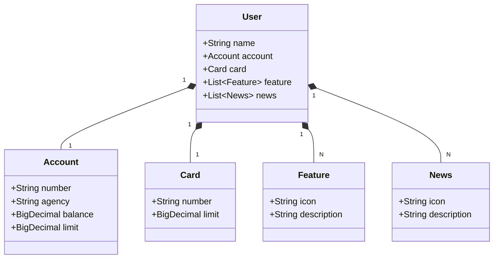

# Minha primeira API RESTful

Este projeto é uma API RESTful desenvolvida com **Spring Boot 3** para gerir um sistema simples de utilizadores, contas bancárias e cartões.

## 📋 Descrição do Projeto
A aplicação permite o registro e a consulta de utilizadores, incluindo detalhes de conta, limites de crédito, funcionalidades e notícias. O projeto utiliza uma arquitetura em camadas (Controller, Service, Repository e Model) e inclui tratamento global de exceções.

## 🛠️ Tecnologias Utilizadas
* **Linguagem**: Java 21.
* **Framework**: Spring Boot 3.4.4.
* **Gestão de Dependências**: Gradle.
* **Persistência de Dados**: Spring Data JPA com Hibernate.
* **Bases de Dados**: 
    * **H2 Database**: Utilizada em ambiente de desenvolvimento (`dev`).
    * **PostgreSQL**: Configurada para ambiente de produção (`prd`).
* **Documentação**: SpringDoc OpenAPI (Swagger).
* **Contentorização**: Docker.

## 📐 Diagrama de Classes

_(Diagrama baseado na estrutura das classes de domínio)_

## 🚀 Endpoints Principais
A API expõe os seguintes endpoints em `/users`:

### GET 
`/users/{id}`:  Procura um utilizador pelo ID.
* Retorna 404 Not Found se o ID não existir.

### POST 
`/users`: Cria um novo utilizador.
* Impede a criação se o número da conta já existir.
* Retorna `422 Unprocessable Entity` em caso de erro de negócio.

## ⚙️ Configuração e Execução
### Execução Local (Gradle)
Para correr a aplicação localmente:

```bash
./gradlew bootRun
```

O console do H2 estará disponível em /h2-console (perfil dev).

### Execução com Docker
O projeto inclui um Dockerfile que utiliza a imagem eclipse-temurin:21-jdk para compilar e correr a aplicação.

```bash
docker build -t minha-api .
docker run -p 8080:8080 minha-api
```

## 🌐 Ambientes
* Desenvolvimento (application-dev.yml): Utiliza base de dados em memória (H2) e formatação de SQL ativa.

* Produção (application-prd.yml): Configurada para PostgreSQL com variáveis de ambiente para credenciais. Inclui suporte para Procfile (ex: Heroku/Render).

