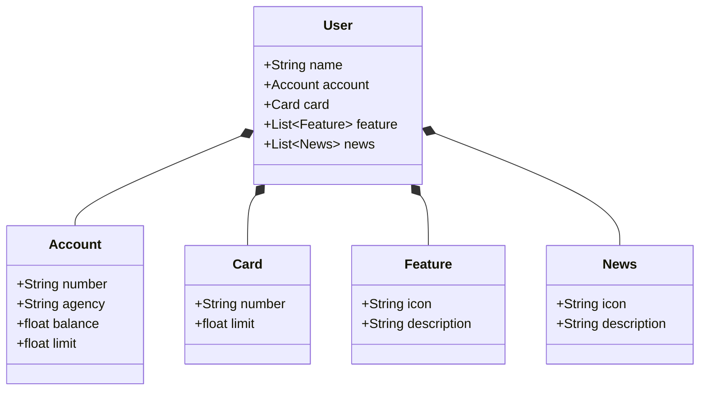

# Minha primeira API RESTful

## Diagrama de classes

```mermaid
  
    classDiagram
  class User {
      +String name
      +Account account
      +Card card
      +List~Feature~ feature
      +List~News~ news
  }

  class Account {
      +String number
      +String agency
      +float balance
      +float limit
  }

  class Feature {
      +String icon
      +String description
  }

  class Card {
      +String number
      +float limit
  }

  class News {
      +String icon
      +String description
  }

  User *-- Account
  User *-- Card
  User *-- Feature
  User *-- News

```
